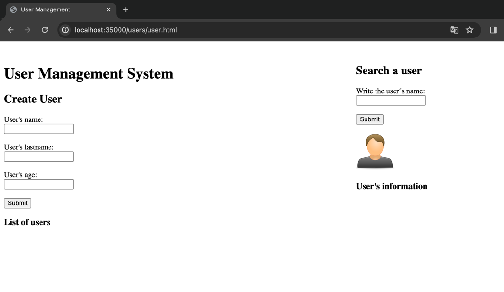
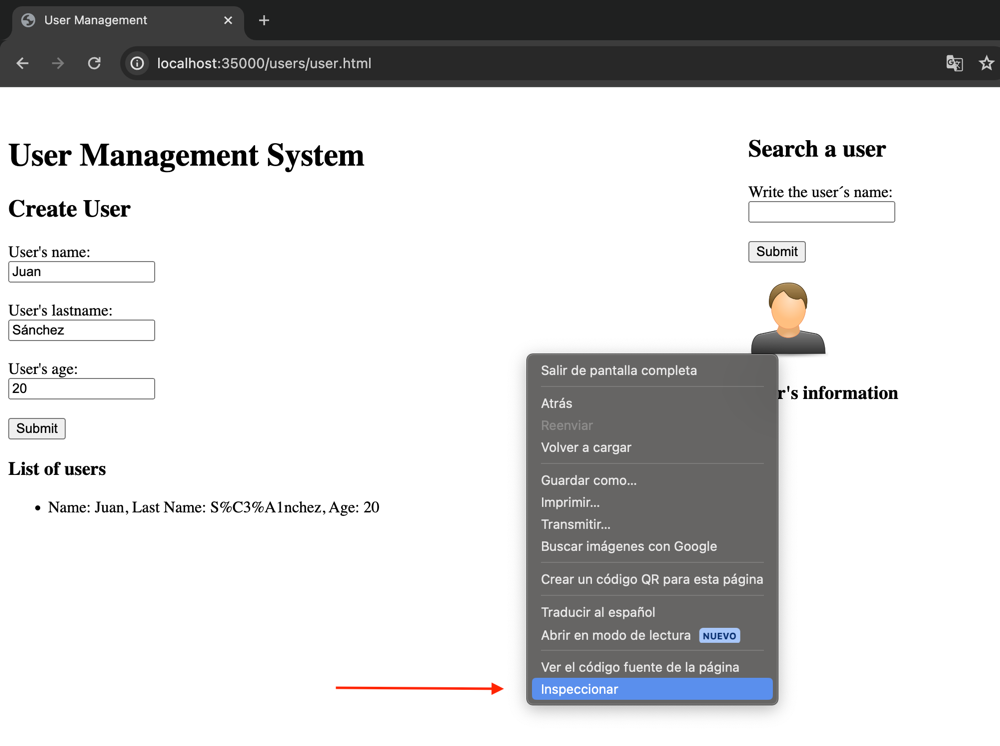
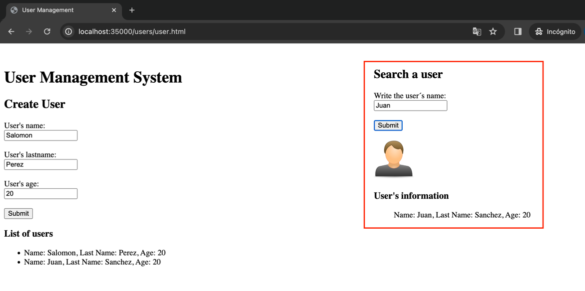
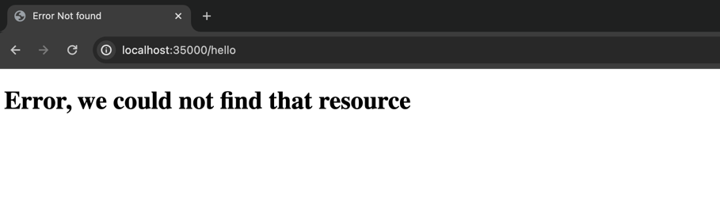

# TALLER DE ARQUITECTURAS DE SERVIDORES DE APLICACIONES, META PROTOCOLOS DE OBJETOS, PATRÓN IOC, REFLEXIÓN
A continuación, se construirá un servidor Web (tipo Apache) en Java, el cual debe proveer un framework IoC para la construcción de aplicaciones web a partir de POJOS, simulando el funcionamiento de Spring.

## Autor
* **Juan Felipe Sánchez Pérez**

## Instalación y ejecución
### Prerequisitos

* Versión de Java: 21.

### Instalación y uso
1. Clonar el repositorio en la carpeta que desee. Para ello use el siguiente comando:
```
git clone https://github.com/juansanxz/Lab04-AREP.git
```
2. Compile el proyecto, usando:   
```
mvn compile
```
3. Ahora, abra la consola o la línea de comandos, y vaya a la carpeta raíz del proyecto _Lab04-AREP_. Una vez allí, ejecute el comando que se muestra a continuación:  
```
java -cp "target/classes" edu.escuelaing.arem.ASE.app.MyWebServices edu.escuelaing.arem.ASE.app.springsimulation.controllers.UserController  
```  
Con este comando, se ejecutará la clase _MyWebServices.java_, que se encarga de instanciar y crear el servidor web _HttpServer.java_, y se le envía de parámetro la clase _UserController.java_, que contiene los servicios para la creación y búsqueda de usuarios, construida usando el framework IoC configurado aprovechando la reflexión de Java.  
Una vez lo haga, verá lo siguiente:  
  
4. Diríjase a la siguiente URL en su browser (en este caso se está usando Chrome) para acceder a la aplicación web: `http://localhost:35000/users/user.html`:  
  
5. Estando allí, cree un usuario, ingresando todos los campos solicitados en el apartado de _Create User_, y dando clic en _Submit_:    
  
6. A continuación, vamos a ver quién recibe la solicitud de crear y obtener usuarios. Para ello, de clic derecho y seleccione la opción _Inspeccionar_:  

7. Una vez se abra esta opción, vaya al segmento de _Network_, donde podrá observar a quien se hizo la solicitud _POST_ y _GET_.  
Para el caso de la solicitud _POST_:  
  
Esta solicitud es atendida por el controlador _UserController.java_:   
```
@PostMapping("/users")
    public static void newUser(@RequestBody String user) {
        User newUser = new User(user);
        usersService.save(newUser);
    }
```  

Para el caso de la solicitud _GET_ para mostrar a los usuarios creados:  
  
Esta solicitud es atendida por el controlador _UserController.java_:  
```
@GetMapping(value = "/users", contentType = "application/json")
    public static String getAll() {
        return usersService.all().toString();
    }
```
8. Probemos ahora la solicitud _GET_ que pide un usuario en específico. Para ello, crea otro usuario, y luego, en el apartado de _Search a user_ escriba el nombre del usuario que desea consultar:  
  
9. Si revisamos nuevamente las herramientas del desarrollador, se identificará la petición realizada:  
  
La cual fue atendida por el controlador _UserController.java_:  
```
@GetMapping(value = "/users/user", contentType = "application/json")
    public static String getUser(@PathVariable("id") String id) {
        return usersService.findById(id).toString();
    }
```  
10. Si desea acceder al servicio expuesto por el otro controlador en la URL `http://localhost:35000/hello`, no podrá hacerlo porque solo se instanció al controlador _UserControler.java_:  
  
11. Detenga la ejecución con _Control + C_ y copie el siguiente comando para acceder al servicio expuesto por _HelloController.java_:  
```
java -cp "target/classes" edu.escuelaing.arem.ASE.app.MyWebServices edu.escuelaing.arem.ASE.app.springsimulation.controllers.HelloController
```
12. Ahora si, diríjase a la siguiente URL `http://localhost:35000/hello`:
  
Como vemos, ahora si funciona.  
13. Finalmente, vamos a probar el funcionamiento de la búsqueda y lectura de las clases que tengan la anotación _@Component_ en la carpeta controllers, donde estarán ubicados; para que estas no tengan que mandarse como parámetro a través de la línea de comandos. Para ello, copie el siguiente comando:  
```
java -cp "target/classes" edu.escuelaing.arem.ASE.app.MyWebServices
```  
14. Ingrese al browser, e ingrese a las dos URLs usadas anteriormente para probar que todos los controladores se cargaron exitosamente:  
Primero: `http://localhost:35000/users/user.html`  
  
Y luego:  `http://localhost:35000/hello`  
  

## Ejecutando los tests
Para ejecutar los tests, puede hacerlo desde su IDE. En este caso, a través de IntelliJ, haciendo clic en la siguiente opción, desde la clase _AppTest.java_:    

Como vemos, se ejecutaron de forma exitosa:    


### Tests

La implementación de las pruebas se encuentra en el código. Buscan probar que se esté solicitando correctamente la información de la película a la API Rest externa.  

## Decisiones de diseño
La arquitectura que se diseñó e implementó para este laboratorio está compuesta por un servidor web que simula al framework IoC de Spring para la creación de aplicaciones web.
* Se implementaron las siguientes anotaciones: 
  * _@Component_: Para indicar qué clases exponen un servicio web.
  * _@GetMapping_: Responde a las solicitudes _GET_.  
  * _@PostMapping_: Responde a las solicitudes _POST_.
  * _@PathVariable_: Permite indicar que un parámetro viene en la query de la URI.
  * _@RequestBody_: Indica que en el parámetro se usara el body de la solicitud _POST_.
* Se configuró la clase _HttpServer.java_ para atender las solicitudes HTTP que se hacen a los controladores configurados por el usuario que usó el framework creado. Para ello se aprovecharon las capacidades reflexivas de Java.
* Se implementaron dos controladores, _UserController.java_ y _HelloController.java_, que son ejemplos de cómo implementar el framework desarrollado para crear aplicaciones web.  

### ¿Cómo desarrollar aplicaciones en el servidor?
Para desarrollar una aplicación usando el servidor de aplicaciones creado, el usuario crea una clase en la carpeta _controllers_ donde define las operaciones que desee (ese será el controlador, que debe tener la anotación _@Component_), utilizando las anotaciones mencionadas anteriormente.
Por ejemplo, para la implementación de la clase `UserController.java`, se indicó que es un componente que expone un servicio, y en los métodos se usaron las anotaciones correspondientes de acuerdo a la operación que se deseaba implementar:   
```
@Component
public class UserController {
    static UsersService usersService = new UsersServiceImpl();

    @GetMapping(value = "/users", contentType = "application/json")
    public static String getAll() {
        System.out.println("Entre a users get");
        return usersService.all().toString();
    }

    @PostMapping("/users")
    public static void newUser(@RequestBody String user) {
        User newUser = new User(user);
        System.out.println("Entre a users Post");
        usersService.save(newUser);
    }

    @GetMapping(value = "/users/user", contentType = "application/json")
    public static String getUser(@PathVariable("id") String id) {
        return usersService.findById(id).toString();
    }
}

```
En las anotaciones _@GetMapping_ y _@PostMapping_, se debe indicar que recurso atiende, y para el caso específico de _@GetMapping_, se especifica el content-type de la respuesta.

## Build
* Maven - Administración de dependencias

## Versión
1.0


