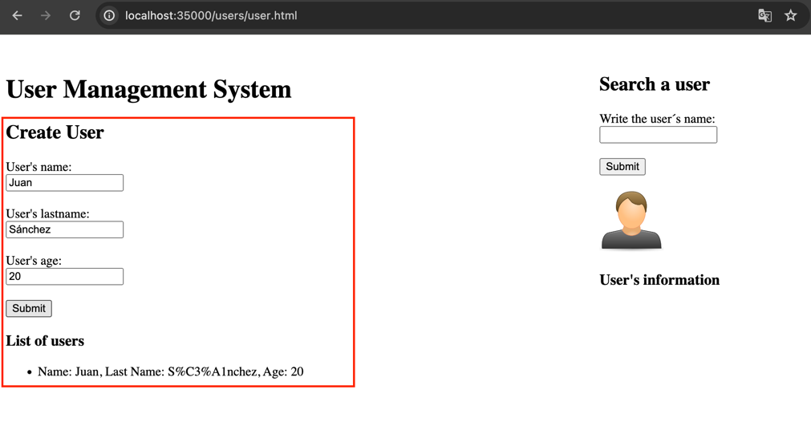
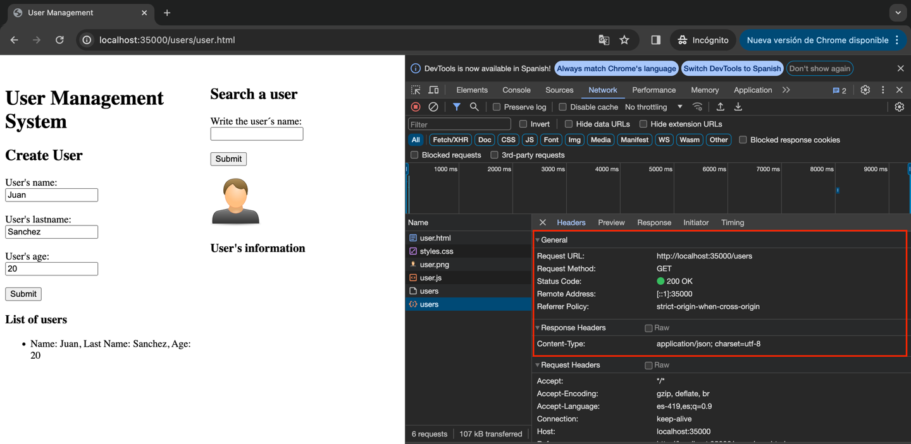
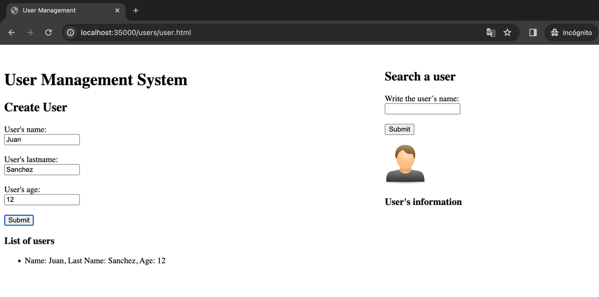
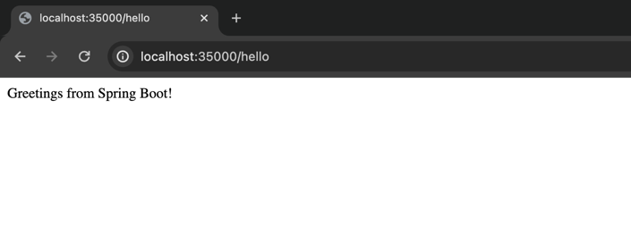

# MICROFRAMEWORKS WEB
A continuación, se explorará el microframework WEB denominado sparkweb (https://sparkjava.com/), el cual permite construir aplicaciones web de manera simple usando funciones lambda.
Lo que se hará es construir un  servidor web para soportar una funcionalidad similar a la de Spark.  

## Autor
* **Juan Felipe Sánchez Pérez**

## Instalación y ejecución
### Prerequisitos

* Versión 1.8 de Java.
* Si no cuenta con tal versión para ejecutarla desde la consola, diríjase a un IDE como IntelliJ en donde puede descargar y usar una versión específica de java para el proyecto.

### Instalación y uso
1. Clonar el repositorio en la carpeta que desee. Para ello use el siguiente comando:
```
git clone https://github.com/juansanxz/Lab03-AREP.git
```  

2. Dirijase a su IDE y abra el proyecto, en este caso se estará haciendo el proceso con IntelliJ.
3. Configure el directorio que desea para buscar los archivos estáticos. En este caso, se usará `/public`, especificándolo en la siguiente línea de la clase `MyWebServices.java`:
   ```
   HttpServer.location("/public");
   ```
4. Ejecute la aplicación desde la clase `MyWebServices.java`, que se encarga de solicitar al servidor web los servicios que este ofrece, simulando el comportamiento de Spark.  
     

5. Una vez ejecutada la aplicación, vaya a su browser de preferencia y dirijase a la siguiente URL para probar la aplicación web: `http://localhost:35000/public/cliente.html`.  
   En esta ocasión, yo lo haré con Chrome. Cuando esté allí, observará que se cargó satisfactoriamente el archivo estático:  
     
6. Tenga en cuenta que si intenta obtener otro recurso que no existe en el directorio especificado, como por ejemplo `http://localhost:35000/public/tareas.html`, se le devolverá un recurso que contiene lo siguiente:  
      
7. Al igual que en el laboratorio anterior, puede digitar el nombre de la película que quiera consultar. En esta ocasión, se consultó _The silence of the lambs_:  
     
8. Presione clic derecho (en Mac clic + control) y vaya a la opción de inspeccionar, para observar a donde se están solicitando los archivos de la app.    
      
9. Dirijase al apartado de _Network_, para identificar cual fue el recurso solicitado, y el path asociado a este para poder encontrarlo:      
      
10. Dar clic en el botón _Submit_, para obtener la información.  
      
11. Será redirigido a otra URL en la que se le mostrará de forma detallada la información de la película, y donde podrá visualizar la solicitud de los recursos requeridos por la aplicación. En la imagen se indica que el recurso fue obtenido del directorio que el usuario configuró:  
       
    Y esta fue la operación que implementó para atender tal solicitud:  
    ```
    HttpServer.get("/movieData", (req, res) -> {
    res.setStatus(200);
    res.setType("application/json");
    return movieData.get();
    });
    ```  
12. Ahora, para continuar probando que funciona la configuración del directorio desde donde obtendrá los archivos de forma estática, dirijase nuevamente a la clase `MyWebServices.java`, y establezca el directorio `/users`:  
      

13. Ejecute la aplicación nuevamente, y observe que ya no encontrará el recurso solicitado anteriormente a través de la URL `http://localhost:35000/public/cliente.html`:  
      
14. Ahora, vamos a solicitar un recurso mediante la siguiente URL `http://localhost:35000/users/user.html`, para probar las funciones POST y GET implementadas para crear y obtener usuarios respectivamente:    
      
15. A continuación, vamos a realizar una solicitud POST. Ingrese los datos solicitados en el formulario y abra las herramientas del desarrollador en el browser:  
      
16. Al hacer clic en _Submit_, se realiza la solicitud POST al servidor:
    
    El usuario implementó este servicio indicando el tipo del contenido de la respuesta, y el código de respuesta de la misma:  
    ```
    HttpServer.post("/createUsers", (req, res) -> {
    res.setStatus(201);
    res.setType("text/html");
    String userString = req.getBody();
    usersService.save(new User(userString));
    return HttpServer.httpResponseCreated();
    });
    ```  
17. Lo cual se observa en el apartado de _Network_:  
      
18. Si vamos ahora a observar la solicitud de _allUsers_, que se llama en el js para obtener todos los usuarios creados luego de oprimir el botón _Submit_, se identifica a quien se hizo la solicitud y el encabezado de la respuesta:  
      

## Ejecutando los tests
Para ejecutar los tests, puede hacerlo desde su IDE. En este caso, a través de IntelliJ, haciendo clic en la siguiente opción, desde la clase _AppTest.java_:    
  
Como vemos, se ejecutaron de forma exitosa:    
  

### Tests

La implementación de las pruebas se encuentra en el código. Buscan probar que se esté solicitando correctamente la información de la película a la API Rest externa.  

## Decisiones de diseño
La arquitectura que se diseñó e implementó para este laboratorio está compuesta por un servidor web, que interactúa con una aplicación web, la cual sirve para que los usuarios desarrollen sus aplicaciones y expongan sus servicios. A su vez, tal como en el laboratorio anterior, la aplicación web le solicita a una API externa información.  
* La clase `HttpServer.java` es quien se encarcarga de administrar el servidor web, atendiendo las peticiones HTTP, leyendo del disco los recursos y enviándolos oportunamente cuando le son solicitados.
* Se configuró el servidor de aplicaciones Web en la clase `MyWebServices.java`, donde el usuario desarrolla las aplicaciones.  
* Para simular el funcionamiento de Spark, se crearon dos clases, `HttpRequest.java` y `HttpResponse.java`, que le brindan al usuario multiples funcionalidades como obtener el body de una operación HTTP POST, o establecer el estado de una respuesta (como por ejemplo, 200), e incluso establecer el _Content-type_ de la respuesa.  

### ¿Cómo desarrollar aplicaciones en el servidor?
Para desarrollar una aplicación usando el servidor de aplicaciones creado, el usuario crea una clase donde define las operaciones que desee en el método main de la misma, que será la que se ejecutará.  
En este caso, será la clase `MyWebServices.java`:  
  
Una vez allí, a través del método estático `HttpServer.location("/users");` definimos el directorio donde se buscarán los archivos estáticos.  
  
Ahora, se empiezan a registrar los servicios POST y GET. Para el ejemplo, se van a crear los servicios para crear y obtener usuarios, por lo tanto se implementó la clase `User.java`, que contiene la información de los usuarios,  y se realizó una implementación de la interfaz `UsersService.java` que gestiona las operaciones de los usuarios. Hecho esto, se crea un objeto de dicha implementación `UsersServiceImpl.java` en la clase `MyWebServices.java`, que es donde estamos trabajando. 
* En primer lugar, para el servicio POST, se hace un llamado al método estático definido `HttpServer.post("/createUsers", (req, res) -> {//Code})`, que recibe como primer parámetro la ruta específica que atenderá, y como segundo una función lambda que tendrá lo que el usuario desee implementar. La implementación para el ejemplo fue la siguiente:  
```
HttpServer.post("/createUsers", (req, res) -> {
            res.setStatus(201);
            res.setType("text/html");
            String userString = req.getBody();
            usersService.save(new User(userString));
            return HttpServer.httpResponseCreated();
        });
```
A través de _req_ el usuario puede obtener el body de la solicitud POST, y usando _res_, configura el código de respuesta y el tipo de el contenido de la misma. En la implementación, se envían los datos del usuario que se desea crear. El funcionamiento de esto lo observa en la sección _Instalación y uso_ que se encuentra al comienzo de este documento.  
* Para el caso del servicio GET, se debe llamar al método estático `HttpServer.get(String route, (req, res) -> {//Code})`. En este caso, la implementación fue la siguiente:  
```
HttpServer.get("/allUsers", (req, res) -> {
            res.setStatus(200);
            res.setType("application/json");
            return usersService.all().toString();
        });
```
Como se observa, a través del parámetro _res_ se puede modificar el estado de la respuesta y el tipo del contenido de la misma. La función lambda debe retornar un String. El funcionamiento de esto lo observa en la sección _Instalación y uso_ que se encuentra al comienzo de este documento.  
Una vez implementados los servicios, se inicia el servidor Web a través de la siguiente línea de código `HttpServer.getInstance().runServer(args);`, donde al ejecutar la clase `MyWebServices.java` que fue en la que se trabajó, podrá acceder a los servicios desarrollados.

### Pruebas en varios sistemas operativos
1. Prueba en macOS  
Al configurar en la clase `MyWebServices.java` el directorio `/users`, ejecutarla, e ingresar a la URL `http://localhost:35000/users/user.html`, se observa que funciona correctamente:  
Ingresamos la información del usuario y al dar clic en el botón _Submit_, se ejecuta la solicitud POST:   
  
Se observa además la solicitud Get para traer a los usuarios:  
  

2. Prueba en Windows  
Ingresamos a la URL  `http://direccion.ip.servidor:35000/users/user.html`, donde _direccion.ip.servidor_ en este caso es _192.168.1.102_. Añadimos otros usuarios más, y vemos que se realizan las operaciones de forma exitosa.  


3. Prueba en Linux a través de máquina virtual  
Ingreamos de la misma forma como se hizo en Windows, y añadimos al usuario _Antonio_, comprobando el funcionamiento:  
  

## Build
* Maven - Administración de dependencias

## Versión
1.0


